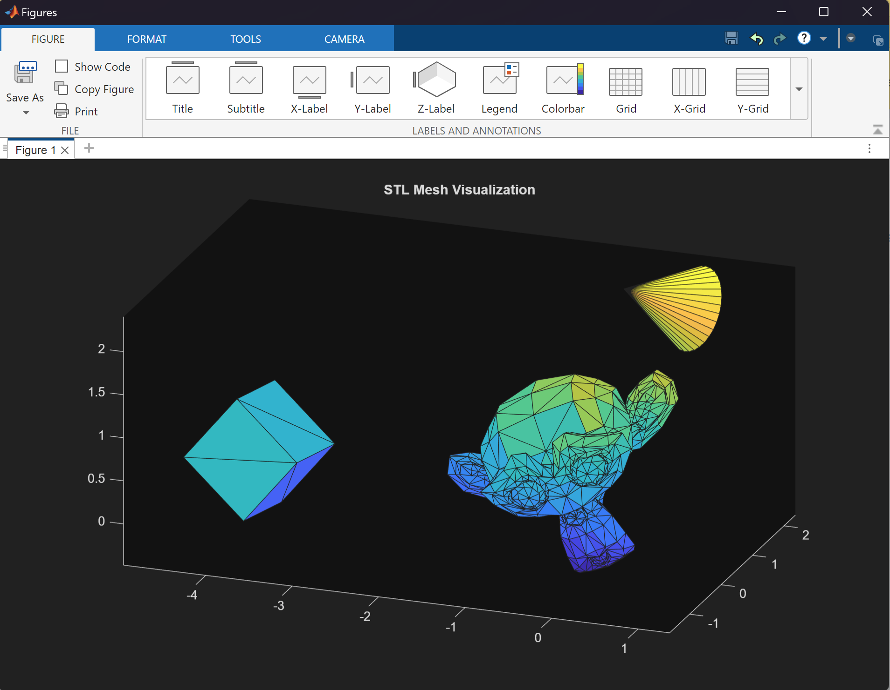
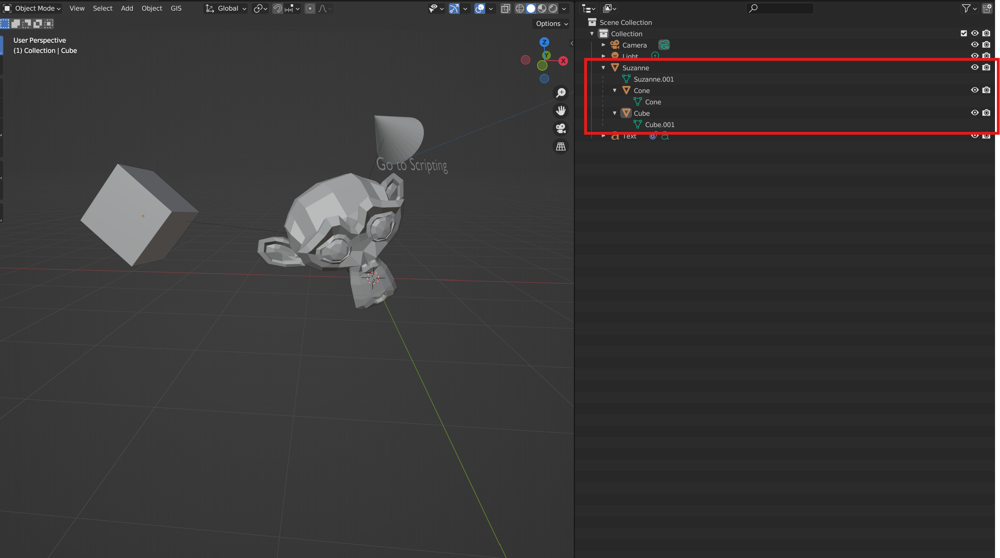
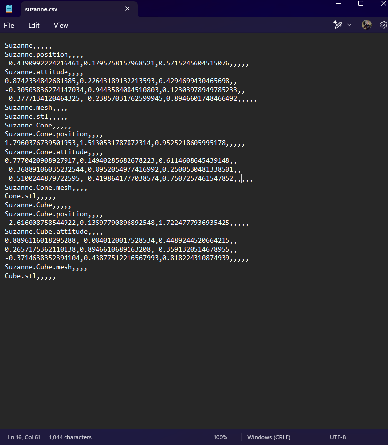
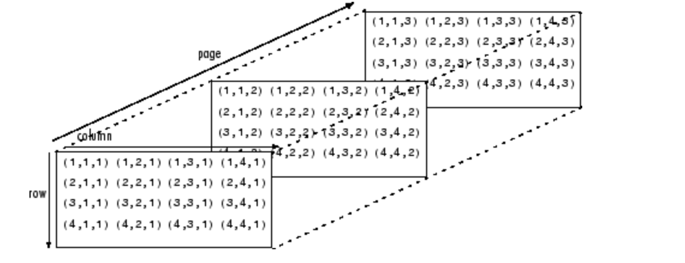
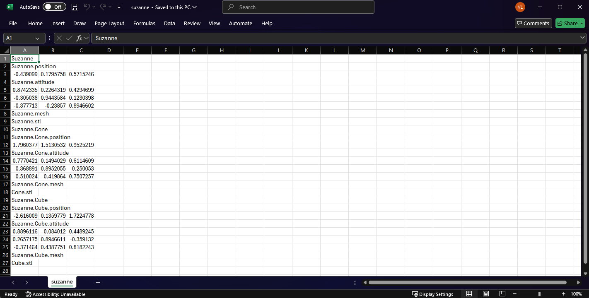

MatlabBlenderIO
==============
**Author:** *Vilgot Lötberg, vilgotl@kth.se*
# Introduction
This package includes functions for both Blender (python, see bpy API: https://docs.blender.org/api/current/index.html) and MATLAB to import and export objects of nested meshes and axes between the two, with .csv-files as an intermediate step. The capabilities of the package is limited to the following application:


Demonstrations of the below code can be found under **Examples/**

### Future work

Not yet to be included, but which are on the list of things to implement:

* Live-rendering in Blender directly from MATLAB.
* Export of animations and curves from Blender.

 

## Contents

### Installation
* Manual installation
* Access from MATLAB
### Syntax
* csv2obj
* obj2csv
* matrix2csvtext
* csvtext2matrix
* query_csv
* draw_obj (MATLAB only)
### General
* csv-parsing


# Installation

An installation-script can be found in this repo's top level, ```installer.bat```. By downloading this and running it, the package should install automatically.

## Manual installation

Additionally, or of this doesn't work, installation can be done through pip in powershell or cmd:

```powershell
PS C:\Users\some_user\> pip install MatlabBlenderIO
```
This puts MatlabBlenderIO on a path that is reachable.

**[NOTE]:** Blender runs on a seperate python-executable, and thus the package has to be installed there as well. It's usually located at ``` C:\Program Files\Blender Foundation\Blender 3.6\3.6\python\bin\python.exe ```, and the package can be installed there as well by:

```powershell
"C:\Program Files\Blender Foundation\Blender 3.6\3.6\python\bin\python.exe" -m pip install MatlabBlenderIO
```

If the Blender-python executable is not located there, it can be found by going into Blender>Scripting and typing:

```python
>>> import sys
>>> sys.executable
'C:\\Program Files\\Blender Foundation\\Blender 3.6\\3.6\\python\\bin\\python.exe'
```

If the resulting path is different, it should be used instead.


### Access from MATLAB
The library will not automatically end up on the MATLAB-path, but has to be added manually. To do this, add this to the start of your MATLAB script:

```MATLAB
%% Add MatlabBlenderIO to path:
[library_failiure, library_status] = system("pip show MatlabBlenderIO");

if library_failiure ;disp(library_status);error("Package not found."); end

addpath(genpath(strip(extractBetween(string(library_status), "Location: ", "Requires:"))+"\MatlabBlenderIO"));

```

Until MATLAB adds a way to add the path to pip-packages via a single command, this is the way we'll have to do it.

# syntax

## csv2obj
### MATLAB

**struct = csv2obj(filepath)** | *Where **filepath** is the path to the .csv file.*

**[NOTE]:**
In MATLAB, the mesh of an object is not imported directly, but can rather be imported manually when needed. This is to save on compute-time for applications that do not directly interact with the mesh, for example if iterating the position in an ODE-solver. Then copying the mesh over and over again would become unneccesarily computationally intensive.


Example:
``` MATLAB
MATLAB >> suzanne = csv2obj(".\Suzanne\Suzanne.csv")

suzanne = 

  struct with fields:

     is_body: 1
    position: [3×1 double]
    attitude: [3×3 double]
        mesh: 'Suzanne.stl'
        Cone: [1×1 struct]
        Cube: [1×1 struct]

```


### Blender python

**obj = csv2obj(filepath)** | *Where **filepath** is the path to the .csv file.*

Example:

``` python
import MatlabBlenderIO, bpy

filepath = __file__.replace("Matlab2Blender_demo.blend\\Text", "Suzanne\\Suzanne2.csv")

MatlabBlenderIO.csv2obj(filepath)
```

## obj2csv

### MATLAB


**obj2csv(filepath, obj)** | *Where **filepath** is the path to the .csv file, and **obj** is a MATLAB-struct (optionally with properties position, attitude and/or mesh).*

Example:


``` MATLAB
>> obj2csv(".\Suzanne\Suzanne2.csv", suzanne)
```


### Blender python


**obj2csv(filepath, obj)** | *Where **filepath** is the path to the .csv file, and **obj** is a bpy-object.*

Example:

``` python

import MatlabBlenderIO, bpy

filepath = __file__.replace('source.blend\Text', 'suzanne.csv')
obj      = bpy.data.objects['Suzanne']

MatlabBlenderIO.obj2csv(filepath, obj)
```


## matrix2csvtext

### MATLAB

**text = matrix2csvtext(mat, starting_delimiter** (optinal) **)** | *Where **mat** is an n-dimensional matrix, **starting_delimiter** is the smallest number of delimiters used to seperate the fastest changing index of the matrix (see General > csv-parsing), and **text** is the matrix represented as a string, ready to be written to a .csv file.*

Example:

``` MATLAB
>> text = matrix2csvtext(zeros(3,2,3))

text = 

    "0,0,0,,\n0,0,0,,,\n\n0,0,0,,\n0,0,0,,,\n\n0,0,0,,\n0,0,0"


```
```MATLAB

>> text = matrix2csvtext(zeros(3,2,2), ",,,")

text = 

    "0,,,0,,,0,,,,\n0,,,0,,,0,,,,,\n\n0,,,0,,,0,,,,\n0,,,0,,,0"

```
```MATLAB

>> text = matrix2csvtext([1,2,3;4,5,6;7,8,9])

text = 

    "1,4,7,,\n2,5,8,,\n3,6,9"

```


### Blender python

**text = matrix2csvtext(mat, starting_delimiter = my_starting_delimiter** (optinal) **)** | *Where **mat** is a n-dimensional numpy-array (or similar that can be converted to a numpy-array), **starting_delimiter** is the smallest number of delimiters used to seperate the fastest changing index of the matrix (see General > csv-parsing), and **text** is the matrix represented as a string, ready to be written to a .csv file.*

```python
>>> import MatlabBlenderIO as mlb
>>> import numpy as np
>>> print(matrix2csvtext(np.array(  ((1,2,3),(4,5,6),(7,8,9))  )))
1.0,2.0,3.0,,
4.0,5.0,6.0,,
7.0,8.0,9.0
```
```python
>>>print(matrix2csvtext(np.array(  (1,2,3)  ), starting_delimiter = ",,,,"))
1.0,,,,2.0,,,,3.0
```


## csvtext2matrix

### MATLAB
**mat = csvtext2matrix(text)** | *Where **text** is a string containing the matrix-information in string form, with the number of **","** denoting iteration over a corresponding dimension, and **mat** is the resulting n-dimensional matrix .*


Example:
```MATLAB

>> [testmat, dimensions] = csvtext2matrix("0,0,0,,0,0,0,,,0,0,0,,0,0,0,,,0,0,0,,0,0,0")

testmat(:,:,1) =

     0     0
     0     0
     0     0


testmat(:,:,2) =

     0     0
     0     0
     0     0


testmat(:,:,3) =

     0     0
     0     0
     0     0


dimensions =

     3     2     3

```
```MATLAB
>> [testmat, dimensions] = csvtext2matrix("0,1,0,,0,0,0,,,0,5,0,,8,0,0")

testmat(:,:,1) =

     0     0
     1     0
     0     0


testmat(:,:,2) =

     0     8
     5     0
     0     0


dimensions =

     3     2     2

```


### Blender Python
**mat, shape = csvtext2matrix(text)** | *Where **text** is a string containing the matrix-information in string form, with the number of **","** denoting iteration over a corresponding dimension, and **mat** is the resulting n-dimensional numpy-array.*


Example:

```python
>>>print(csvtext2matrix("0,,,,1,,,,2,,,,4"))
(array([0., 1., 2., 4.]), [4])
```

```python
>>>print(csvtext2matrix("0,1,0,,0,0,0,,,0,5,0,,8,0,0"))
(array([[[0., 0.],
        [0., 8.]],

       [[1., 5.],
        [0., 0.]],

       [[0., 0.],
        [0., 0.]]]), [3, 2, 2])

```


## query_csv
### MATLAB

**data = query_csv(filepath, inquiry)** | *Where **filepath** is the path to the file being queried,  **inquiry** is the parameter one wants to extract, and **data** is the final result.*

**[NOTE]:** The query_csv function tries to convert the data to a matrix using the **csvtext2matix** function, and upon failing to do so returns the raw data as a string instead.

Example:

``` MATLAB
>> query_csv(".\Suzanne\suzanne.csv", "attitude")

ans =

    0.8742   -0.3050   -0.3777
    0.2264    0.9444   -0.2386
    0.4295    0.1230    0.8947

```
```MATLAB
>> query_csv(".\Suzanne\suzanne.csv", "Cube.mesh") 

ans =

    'Cube.stl'
```


### Blender Python


**data, shape = query_csv(filepath, inquiry)** | *Where **filepath** is the path to the file being queried,  **inquiry** is the parameter one wants to extract, **data** is the final result, and **size** is the shape of said result.*

**[NOTE]:** The query_csv function tries to convert the data to a matrix using the **csvtext2matix** function, and upon failing to do so returns the raw data as a string instead.


```python
>>> import MatlabBlenderIO, bpy
>>> print(MatlabBlenderIO.query_csv(filepath, "attitude"))
(array([[ 0.87423, -0.30504, -0.37771],
       [ 0.22643,  0.94436, -0.23857],
       [ 0.42947,  0.12304,  0.89466]]), [3, 3])
```
```python
>>> print(MatlabBlenderIO.query_csv(filepath, "mesh"))
('Suzanne.stl', 0)
```


## draw_obj
### MATLAB

**draw_obj(ax, obj)** | *Where **ax** is the axes-object to be plotted in, and **obj** is the object to be drawn in the plot.*

**[WARNING]:** The axes has to be current axes. Improvement upon this is being worked on, and can be expected in future updates.

Example:

``` MATLAB
>> suzanne = csv2obj(".\Suzanne\Suzanne.csv");
>> draw_obj(axes(), suzanne)
>> axis equal
>> title('STL Mesh Visualization')
>> view(20,20)

```
Result:



Compared to the original scene in Blender:




# General

## csv-parsing

The csv-files for this project take on the following basic appearance:



The reason for this is to support animation, which requires multidimensional data. For example, the attitude matrices over multiple timesteps can be concatenated as 3d-matrices in MATLAB (see MATLAB Multidimensional Arrays https://se.mathworks.com/help/matlab/math/multidimensional-arrays.html), and then sent to Blender to be animated over multiple keyframes.


*Source: Matlab Multidimensional Arrays*


Of course, one could flatten the matrices out beforehand, but it requires the reciever to have knowledge beforehand that this is has to be reshaped back, the file itself doesn't encode dimensional data at all. That makes it hopeless when working with multiple cases and multiple types of data, where the data sometimes has to be reshaped, sometimes not.

It is with this in mind that this application encodes the dimension via the number of ","-signs used as delimiters, where the fastest changing dimensional index uses ",", the next fastest ",,", the next ",,,", and so on. The upsides of encoding the dimensions like this is that the file is still readable to a normal .csv-parser, allowing one to read, view and/or edit the file in Microsoft Excel or similar if one wants to:

